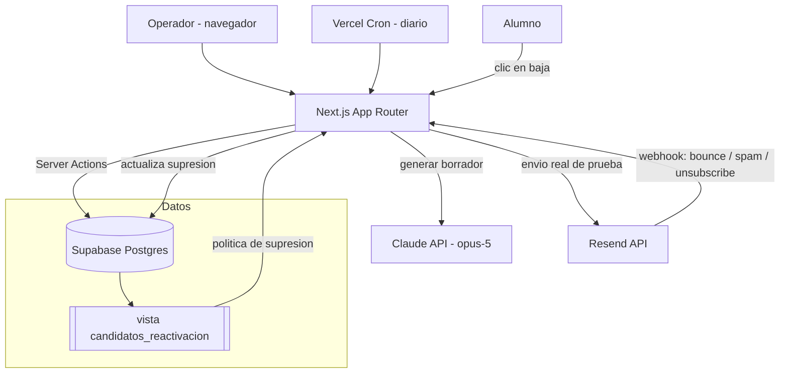

# Arquitectura técnica

Documento vivo. Actualizar cada vez que cambie el stack, la estructura de carpetas o cualquier
decisión técnica relevante. Los cambios se registran también en `changelog/`.

---

## Stack seleccionado

| Capa | Tecnología | Justificación |
|---|---|---|
| Framework | **Next.js 16 (App Router)** | Server Actions cubren todas las mutaciones sin montar una API aparte. Las claves de Claude y Resend nunca tocan el cliente. Streaming nativo para el borrador generado. |
| Lenguaje | **TypeScript** (estricto) | El dominio tiene demasiados booleanos peligrosos (`consentimiento_marketing`, `hard_bounce`, `opt_out_at`) como para trabajar sin tipos. Se generan desde el esquema de Supabase. |
| Base de datos | **Supabase (PostgreSQL)** | El `schema.sql` del dataset ya es Postgres puro: `citext`, columnas generadas y vistas. Importa sin tocar una línea. Además da auth y despliegue de migraciones en el mismo sitio. |
| Autenticación | **Supabase Auth** (magic link, lista blanca de correos) | Herramienta interna para un equipo pequeño. Sin contraseñas que gestionar. |
| Generación de texto | **Claude API** (`claude-opus-5`) | Redacta asunto y cuerpo. Se eligió Opus porque el email *es* el producto: un texto que suene a plantilla arruina la campaña entera. Un borrador tarda 5–8 s. Se cambia con `ANTHROPIC_MODEL`. |
| Envío de email | **Resend** | API sencilla, buena entregabilidad y modo de prueba. En este proyecto solo se usa para el envío real al buzón del operador. |
| Estilos | **Tailwind CSS + shadcn/ui** | Velocidad, y los tokens de shadcn se reemplazan por los de marca sin pelear con el framework. |
| Gráficas | **Recharts** | Suficiente para tasas por segmento y comparación con holdout. |
| Despliegue | **Vercel** | Zero-config para Next.js, previews por rama y Vercel Cron para el disparo diario. |
| Gestor de paquetes | **pnpm v11** | Convención del proyecto. No usar npm ni yarn. |

**Modelos:** `claude-opus-5` para generar los emails, configurable con `ANTHROPIC_MODEL`. Cada envío guarda `modelo_generador` y
`prompt_version`, de modo que al cambiar de modelo o de prompt las métricas siguen siendo
comparables.

---

## Diagrama de componentes



**Lo importante del diagrama:** la política de supresión vive dentro de la base de datos, en la
vista `candidatos_reactivacion`. La aplicación no puede saltársela porque no tiene otro camino para
obtener candidatos. El prompt del LLM nunca decide a quién se escribe: solo cómo se escribe.

---

## Estructura de carpetas

```
src/
├── proxy.ts                    → Sesión y protección de rutas (era middleware.ts: Next 16 lo renombró)
├── app/
│   ├── (app)/                  → Rutas autenticadas
│   │   ├── cola/               → Cola de revisión (pantalla principal)
│   │   ├── alumnos/            → Listado y ficha con historial de envíos
│   │   ├── plantillas/         → Variantes y su estado en el bandit
│   │   └── resultados/         → Dashboard: uplift, tasas, evolución
│   ├── (auth)/login/           → Magic link
│   ├── auth/callback/          → Canje del enlace por sesión
│   ├── api/
│   │   ├── cron/preparar-cola/ → Disparo diario (protegido por CRON_SECRET)
│   │   └── webhooks/resend/    → Rebotes, quejas y bajas
│   └── baja/[token]/           → Página pública de baja (sin autenticar)
├── components/
│   ├── ui/                     → Base shadcn/ui con tokens de marca
│   ├── cola/                   → FichaAlumno, BorradorEmail, BarraGuardarrailes
│   └── resultados/             → MetricaUplift, gráficas
├── lib/
│   ├── config/entorno.ts       → Validación del entorno y guardarraíl de envío real
│   ├── supabase/               → Clientes (navegador, servidor, servicio) y tipos generados
│   ├── candidatos/             → Lectura de la vista y priorización
│   ├── bandit/                 → Thompson sampling y actualización de priors
│   ├── generacion/             → Prompts, llamada a Claude, validación del resultado
│   └── email/                  → Render del email, firma y cliente de Resend
supabase/
├── migrations/                 → Migraciones SQL en orden
├── seed/                       → Dataset sintético y esquema original del hackathon
└── tests/                      → Tests de la política de supresión (contra base de datos)
scripts/
├── importar-dataset.ts         → dataset.json → Supabase (pnpm seed)
└── probar-generacion.ts        → Genera un borrador real por consola, sin tocar la BD
```

**Regla:** la lógica que decide *a quién* se escribe está en `lib/candidatos/` y en SQL. La que
decide *qué* se escribe está en `lib/generacion/`. No se mezclan: es lo que permite auditar la
supresión sin leer prompts.

---

## Estrategia de autenticación

Herramienta interna, así que el modelo es deliberadamente simple:

- **Supabase Auth con magic link.** El operador introduce su correo y recibe un enlace. Sin
  contraseñas.
- **Lista blanca.** Solo los correos del equipo pueden entrar; el resto recibe un rechazo silencioso
  y no se crea cuenta.
- **Protección de rutas** en middleware: todo lo que cuelga de `(app)` exige sesión. Sin sesión,
  redirección a `/login`.
- **Excepciones públicas:** `/baja/[token]` (la baja debe funcionar sin cuenta, es un requisito
  legal, y el token es de un solo uso por alumno) y `/api/webhooks/resend` (verificado por firma).
- **Operaciones privilegiadas** —cron y webhooks— usan la clave de servicio, nunca accesible desde
  el cliente.

No hay roles ni permisos por usuario: todo el que entra puede aprobar. Añadir roles está en el
roadmap, no en el MVP.

---

## Integraciones externas

**Claude API** — genera asunto y cuerpo del email. Se llama exclusivamente desde Server Actions.
El prompt recibe únicamente campos concretos de la ficha (nombre, curso, sesión, progreso, días
inactivo, motivo declarado, idioma) más el tono/longitud/CTA de la plantilla elegida. Tiene
prohibido inventar descuentos, plazas o fechas límite. La respuesta se valida contra un esquema
antes de guardarse; si no valida, se reintenta una vez y luego se marca el borrador como fallido.

**Resend** — envío real del email de prueba al buzón del operador. En el MVP no se envía a
direcciones del dataset: son `@example.com` y rebotarían. Su webhook alimenta la supresión
(`hard_bounce`, `queja_spam`, `unsubscribe`), que es el camino por el que un rebote real deja fuera
al alumno automáticamente.

**Supabase** — base de datos, autenticación y migraciones.

**Vercel Cron** — invoca `/api/cron/preparar-cola` una vez al día para dejar los borradores del día
listos antes de que el operador abra la aplicación. Protegido con `CRON_SECRET`. Prepara borradores;
**no envía nada**.

---

## MCPs del proyecto

| Servidor | Alcance | Para qué se usa | Variables necesarias |
|---|---|---|---|
| `supabase` | project | Aplicar migraciones, consultar el esquema y depurar la vista de candidatos sin salir del editor | — (OAuth vía `/mcp`) |

**Supabase** — servidor remoto HTTP oficial en `https://mcp.supabase.com/mcp`, declarado en
`.mcp.json`. Se autentica por OAuth: no hay ninguna clave en el repositorio ni en el entorno. El
`SUPABASE_ACCESS_TOKEN` solo haría falta en CI, donde no es posible el flujo de navegador.

> **Está en modo escritura, a propósito.** No se le pasa `?read_only=true` porque necesita aplicar
> migraciones. Es una decisión consciente: el MCP puede modificar la base de datos.
>
> **Falta fijar el proyecto.** En cuanto exista el proyecto de Supabase, añadir
> `?project_ref=<ref>` a la URL para que el servidor no alcance otros proyectos de la cuenta.

**Pendientes de decidir:** Resend (MCP oficial en `https://mcp.resend.com/mcp`, también OAuth; útil
para revisar entregas, no imprescindible porque la aplicación envía por su cuenta) y Vercel, cuyo
comando habría que verificar en su documentación antes de proponerlo.

**No se instala ninguno sin aprobación explícita**, según el "Protocolo de MCPs" de `CLAUDE.md`:
primero `claude mcp list`, luego verificar el comando en la documentación oficial del proveedor,
enseñarlo, y solo entonces ejecutarlo. Se lanza con `/mcp-setup`.

Los servidores de alcance de proyecto piden aprobación la primera vez que alguien abre el
repositorio. Es el comportamiento esperado, no un fallo.

Recordatorio: las claves reales nunca van en `.mcp.json` —ese archivo se commitea—. Se referencian
como `${VARIABLE}` y el valor vive en `.env.local` o en el entorno del shell.

---

## Estrategia de despliegue

| Entorno | Dónde | Datos | Para qué |
|---|---|---|---|
| Local | `pnpm dev` | Proyecto Supabase de desarrollo con el dataset sintético | Desarrollo diario |
| Preview | Vercel, una por rama | El mismo proyecto de desarrollo | Revisar PRs |
| Producción | Vercel, rama `main` | Proyecto Supabase de producción | La demo del hackathon |

**Flujo:** rama por funcionalidad → PR con la plantilla rellena → preview de Vercel → revisión →
merge a `main` → despliegue automático.

**Migraciones:** archivos versionados en `supabase/migrations/`, aplicados en orden. Nunca se
modifica el esquema desde el panel de Supabase sin que exista la migración correspondiente en el
repositorio.

**Variables de entorno:** definidas en `.env.example` (sin valores). Cada entorno tiene las suyas en
Vercel. La clave de servicio de Supabase, la de Claude y la de Resend solo existen en el servidor.

**Interruptor de seguridad:** `ENVIO_REAL_HABILITADO`. Con el valor a `false` —el predeterminado—
ningún envío sale al exterior aunque alguien llame directamente a la acción de envío. Se activa
solo para la prueba contra el buzón del operador.

---

## Decisiones técnicas relevantes

### 2026-08-13 — La política de supresión vive en SQL, no en el código ni en el prompt

**Contexto:** hay que garantizar que jamás se escriba a alguien sin consentimiento, con rebote duro,
con queja de spam, dado de baja, en el grupo de control o que ya recibió tres correos.
**Opciones consideradas:** (a) filtros en las consultas de la aplicación, (b) validación en la capa
de servicio, (c) una vista de base de datos que sea la única fuente de candidatos.
**Decisión:** (c). `candidatos_reactivacion` viene ya definida en el `schema.sql` del dataset y es el
único origen de la cola.
**Consecuencias:** la aplicación no puede saltarse la política ni por error ni por un refactor
descuidado. Cambiar las reglas exige una migración, que queda registrada. La contrapartida es que
parte de la lógica de negocio no se ve en TypeScript: por eso se documenta aquí y en `data-model.md`.

### 2026-08-13 — Aprobación humana obligatoria antes de cada envío

**Contexto:** el sistema podría enviar solo. El dataset y los guardarraíles lo permitirían.
**Opciones consideradas:** envío autónomo por cron; automático en segmentos seguros e híbrido para
el resto; aprobación humana en todos los casos.
**Decisión:** aprobación humana siempre en el MVP.
**Consecuencias:** el coste de un email mal calibrado a un exalumno es alto y difícil de deshacer.
Se paga con menos volumen por sesión. La arquitectura deja la puerta abierta al modo automático: el
cron ya prepara borradores, solo faltaría dejar que los despache.

### 2026-08-13 — Thompson sampling en lugar de "elegir la plantilla con mejor tasa"

**Contexto:** hay 2 variantes por segmento con muestras pequeñas (entre 21 y 81 envíos).
**Opciones consideradas:** plantilla fija por segmento; elegir siempre la de mejor tasa observada;
Thompson sampling sobre los priors Beta que el dataset ya trae.
**Decisión:** Thompson sampling.
**Consecuencias:** con muestras así de pequeñas, "elegir la mejor" se queda enganchado a un
resultado que puede ser ruido —`t_abandono_tardio_A` tiene 29% con 31 envíos—. Thompson explora en
proporción a la incertidumbre y converge solo. A cambio, es no determinista: los tests fijan la
semilla del generador aleatorio.

### 2026-08-13 — Envío simulado por defecto, real solo al buzón del operador

**Contexto:** los correos del dataset son `@example.com` y no son entregables.
**Decisión:** todo envío se registra en `envios` como si hubiera salido, y el envío real por Resend
solo se dirige a la dirección del operador, detrás del interruptor `ENVIO_REAL_HABILITADO`.
**Consecuencias:** la demo enseña la integración de verdad sin generar rebotes ni dañar la
reputación del dominio. El código de envío es el mismo en ambos modos, así que pasar a producción es
cambiar el destinatario, no reescribir la capa.

### 2026-08-13 — Next.js con Server Actions en lugar de una API separada

**Contexto:** todas las mutaciones (generar, aprobar, descartar, registrar resultado) las dispara la
propia interfaz.
**Decisión:** Server Actions. Los únicos endpoints HTTP son los que consumen terceros: el cron y el
webhook de Resend.
**Consecuencias:** menos superficie y las claves nunca salen del servidor. Si algún día hace falta
una API pública, habrá que extraer la lógica de `lib/` a endpoints, que ya está preparada para eso.
