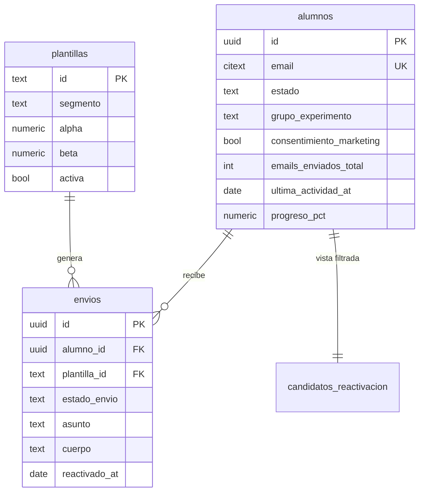

# Modelo de datos

Base de datos: **PostgreSQL (Supabase)**. Consultar este archivo antes de cualquier migración.

El punto de partida es el `schema.sql` que acompaña al dataset del hackathon. Tres tablas y una
vista, más las extensiones que la aplicación necesita para el flujo de aprobación.

---

## Entidades principales

### `alumnos`

Ficha del alumno y **fuente de verdad de la elegibilidad**. 300 registros sintéticos.

| Campo | Tipo | Descripción |
|---|---|---|
| `id` | uuid PK | Identificador |
| `nombre`, `apellidos` | text | Nombre y apellidos |
| `email` | citext único | Correo. En el dataset, siempre `@example.com` (no entregable) |
| `telefono` | text | Prefijo `+34999` (no entregable) |
| `idioma` | text | `es` (219) o `ca` (81). Determina el idioma del email generado |
| `curso_id`, `curso_nombre` | text | Curso contratado. Cuatro cursos en el dataset |
| `cohorte` | text | Trimestre de entrada (`2026-1T`…) |
| `total_sesiones` | int | Sesiones del curso (8–12) |
| `precio_pagado_eur` | numeric | Importe pagado. Base del valor recuperable |
| `fuente_captacion` | text | `linkedin`, `newsletter`, `organico`, `referido`, `evento`, `meta_ads` |
| `fecha_alta`, `fecha_fin` | date | Alta y finalización |
| `estado` | text | `activo` (26), `inactivo` (183), `completado` (77), `baja` (14) |
| `ultima_sesion_completada` | int | Sesión donde se quedó. **El dato más valioso para personalizar** |
| `progreso_pct` | numeric generado | `ultima_sesion_completada / total_sesiones`, redondeado a 2 |
| `ultima_actividad_at` | date | Última señal de vida. Base del cálculo de inactividad |
| `motivo_abandono_declarado` | text | `nivel_bajo`, `falta_tiempo`, `nivel_alto`, `economico`, `cambio_trabajo`, `problema_tecnico`. Vacío en 177 casos |
| `canal_preferido` | text | `email` (220) o `whatsapp` (80) |
| `consentimiento_marketing` | boolean | **Condición necesaria para escribir.** 33 no lo tienen |
| `consentimiento_at`, `opt_out_at` | date | Fechas de consentimiento y de baja. 19 bajas |
| `hard_bounce` | boolean | Rebote duro. 11 casos. Supresión permanente |
| `queja_spam` | boolean | Marcó spam. 2 casos. Supresión permanente |
| `grupo_experimento` | text | `tratamiento` (255) o `holdout` (45). **El holdout nunca recibe nada** |
| `emails_enviados_total` | int | Contador acumulado. Techo duro en 3 |
| `ultimo_envio_at` | date | Base del periodo de enfriamiento de 14 días |
| `reactivado` | boolean | Si ya volvió. 42 casos |
| `reactivado_at`, `tipo_reactivacion` | date, text | Cuándo y cómo: `reinscripcion` (13), `respuesta_email` (18), `login` (11) |

**Campos añadidos por la aplicación:**

| Campo | Tipo | Descripción |
|---|---|---|
| `baja_token` | uuid único | Token de la URL de baja. Permite dar de baja sin autenticación y sin exponer el id ni el correo |

### `plantillas`

Las 8 variantes de mensaje y su estado en el bandit. Dos por segmento (una sola en
`abandono_tardio` y en `completado`).

| Campo | Tipo | Descripción |
|---|---|---|
| `id` | text PK | `t_abandono_temprano_A`… |
| `segmento` | text | Segmento al que aplica |
| `tono` | text | `empatico`, `directo`, `reto`, `urgencia` |
| `longitud` | text | `corta`, `media` |
| `cta` | text | `retomar_sesion`, `reservar_llamada`, `onboarding`, `upsell_siguiente_curso` |
| `asunto_patron` | text | Patrón con huecos (`{nombre}`, `{curso}`, `{sesion}`…). **Guía para el modelo, no plantilla literal** |
| `hora_envio` | time | Hora prevista de salida |
| `activa` | boolean | Si el bandit puede elegirla |
| `envios`, `reactivaciones` | int | Contadores acumulados |
| `alpha`, `beta` | numeric | Priors Beta: `alpha = 1 + reactivaciones`, `beta = 1 + envios − reactivaciones` |

Estado inicial que trae el dataset:

| Plantilla | Envíos | Reactivaciones | Tasa | α / β |
|---|---|---|---|---|
| `t_abandono_temprano_A` (empático) | 54 | 5 | 9,3% | 6 / 50 |
| `t_abandono_temprano_B` (directo) | 58 | 2 | 3,5% | 3 / 57 |
| `t_abandono_medio_A` (empático) | 24 | 3 | 12,5% | 4 / 22 |
| `t_abandono_medio_B` (reto) | 24 | 2 | 8,3% | 3 / 23 |
| `t_abandono_tardio_A` (directo) | 31 | 9 | 29,0% | 10 / 23 |
| `t_nunca_empezo_A` (empático) | 21 | 3 | 14,3% | 4 / 19 |
| `t_nunca_empezo_B` (urgencia) | 24 | 0 | 0,0% | 1 / 25 |
| `t_completado_A` (directo) | 81 | 18 | 22,2% | 19 / 64 |

Dos lecturas útiles: el tono empático gana al directo en abandono temprano, y la variante de
urgencia (*"último aviso antes de liberar tu plaza"*) lleva 24 envíos con cero reactivaciones. El
bandit debería apagarla solo.

### `envios`

Histórico de intentos. 317 registros sintéticos. Es la tabla de auditoría del sistema: cada fila
responde a qué se le mandó a quién, con qué plantilla, quién lo aprobó y qué pasó después.

| Campo | Tipo | Descripción |
|---|---|---|
| `id` | uuid PK | Identificador |
| `alumno_id` | uuid FK → `alumnos` | Destinatario. `on delete cascade` |
| `plantilla_id` | text FK → `plantillas` | Variante usada |
| `segmento`, `canal` | text | Segmento en el momento del envío y canal |
| `asunto`, `cuerpo` | text | Contenido generado, ya personalizado |
| `modelo_generador`, `prompt_version` | text | Trazabilidad. Sin esto no se pueden comparar campañas |
| `enviado_at` | timestamptz | Momento del envío |
| `entregado`, `bounce`, `unsubscribe` | boolean | Resultado de entrega |
| `abierto_at`, `click_at` | date | Apertura y clic |
| `respondido` | boolean | Si contestó |
| `reactivado_at`, `tipo_reactivacion` | date, text | Resultado que alimenta el bandit |

**Campos añadidos por la aplicación** (flujo de aprobación humana):

| Campo | Tipo | Descripción |
|---|---|---|
| `estado_envio` | text | `borrador` → `aprobado` → `enviado`, o `descartado` / `fallido` |
| `aprobado_por` | uuid FK → `auth.users` | Quién le dio al botón |
| `aprobado_at` | timestamptz | Cuándo |
| `editado_por_humano` | boolean | Si el operador tocó el texto. Permite comparar la calidad del modelo con la del modelo + humano |
| `descartado_motivo` | text | Por qué no se envió |
| `envio_real` | boolean | Si salió de verdad por Resend o quedó simulado |
| `resend_id` | text | Identificador del proveedor, para casar los webhooks |

`enviado_at` pasa a admitir nulos: un borrador todavía no se ha enviado.

**Un envío descartado no cuenta.** No incrementa `emails_enviados_total` ni los contadores de la
plantilla: el alumno vuelve a la cola sin gastar uno de sus tres intentos.

### Vista `candidatos_reactivacion`

**La pieza central del sistema.** Única fuente de candidatos: si un alumno no está aquí, la
aplicación no tiene forma de escribirle.

Calcula dos campos derivados —`dias_inactivo` y `segmento_calculado`— y aplica toda la política de
supresión:

| Condición | Por qué |
|---|---|
| `consentimiento_marketing` | Requisito legal |
| `opt_out_at is null` | Se dio de baja |
| `not hard_bounce` | El correo no existe |
| `not queja_spam` | Nos marcó como spam |
| `not reactivado` | Ya volvió, dejarle en paz |
| `estado <> 'baja'` | Se fue de la escuela |
| `grupo_experimento = 'tratamiento'` | El holdout es el grupo de control |
| `dias_inactivo >= 21` | No molestar a quien sigue vivo |
| `ultimo_envio_at is null or dias >= 14` | Periodo de enfriamiento |
| `emails_enviados_total < 3` | Techo de intentos |

Ordena por inactividad ascendente y progreso descendente: **primero el que se fue hace menos tiempo
y más lejos había llegado.** Es el que más fácil vuelve.

Segmentación calculada: `completado` → `nunca_empezo` (0 sesiones) → `abandono_temprano` (<34%) →
`abandono_medio` (<70%) → `abandono_tardio` (resto).

Resultado sobre el dataset actual: **~100 candidatos elegibles** de 300 alumnos —39 abandono
temprano, 24 completados, 16 medio, 12 nunca empezó, 9 tardío—. Los 200 restantes quedan fuera por
alguna de las condiciones de arriba, que es exactamente lo que debe ocurrir.

---

## Relaciones entre entidades

---

## Políticas de acceso (RLS)

RLS activo en las tres tablas. El modelo es simple porque la herramienta es interna: **el equipo lo
ve todo, el público no ve nada.**

### `alumnos`
- SELECT: cualquier usuario autenticado del equipo.
- UPDATE: autenticado, y solo sobre campos de campaña (`emails_enviados_total`, `ultimo_envio_at`,
  `reactivado`, `reactivado_at`, `tipo_reactivacion`, `opt_out_at`). Los datos de la ficha son de
  solo lectura desde la aplicación: se cargan por seed.
- INSERT / DELETE: deshabilitados para usuarios. Solo la clave de servicio, en la importación.

### `plantillas`
- SELECT: autenticado.
- UPDATE: autenticado, sobre `activa`. Los contadores `alpha`/`beta`/`envios`/`reactivaciones` solo
  los toca la función de registro de resultado, para que no se puedan falsear a mano.
- INSERT / DELETE: solo clave de servicio.

### `envios`
- SELECT: autenticado.
- INSERT / UPDATE: autenticado. Es la tabla que la aplicación escribe en el día a día.
- DELETE: **deshabilitado para todos.** Es el registro de auditoría; un envío descartado se marca,
  no se borra.

### Acceso público (rol `anon`)
Sin acceso directo a ninguna tabla. La única operación pública es la baja, a través de una función
`security definer` que recibe el `baja_token`, escribe `opt_out_at` y no devuelve ningún dato
personal. Un token que no existe produce la misma respuesta que uno válido, para no permitir
enumeración.

---

## Migraciones

| Fecha | Archivo | Descripción |
|---|---|---|
| 2026-08-13 | `001_esquema_inicial.sql` | Tablas `alumnos`, `plantillas`, `envios`, índices y vista `candidatos_reactivacion`. Tal cual el `schema.sql` del dataset, más las extensiones `citext` y `pgcrypto` |
| 2026-08-13 | `002_flujo_aprobacion.sql` | Campos de aprobación en `envios`, `baja_token` en `alumnos`, `enviado_at` pasa a admitir nulos, índice de borrador único por alumno. Recrea la vista |
| 2026-08-13 | `003_rls.sql` | RLS, privilegios de columna y `security_invoker` en la vista |
| 2026-08-13 | `004_operaciones_envio.sql` | Funciones `aprobar_envio()`, `descartar_envio()` y `registrar_resultado()` |
| 2026-08-13 | `005_baja_publica.sql` | Función `security definer` de baja por token |

Tres detalles de la 002 y la 003 que conviene tener presentes:

- **La vista se recrea, no se altera.** `select a.*` expande las columnas en el momento de crear la
  vista: sin recrearla, `baja_token` no aparecería entre los candidatos. Las condiciones no cambian
  ni una coma.
- **Índice único de borrador por alumno.** Un alumno no puede tener dos borradores pendientes a la
  vez. Es lo que impide que el cron duplique trabajo si se ejecuta dos veces el mismo día.
- **`security_invoker = on` en la vista.** Por defecto una vista se evalúa con los privilegios de su
  propietario, lo que se saltaría el RLS de `alumnos`. Con esta opción la vista respeta las
  políticas de quien la consulta.

### Funciones

| Función | Qué hace |
|---|---|
| `aprobar_envio(envio_id, envio_real)` | Convierte un borrador en envío. **Revalida la elegibilidad contra la vista** antes de hacerlo, incrementa los contadores del alumno y el denominador del bandit. Idempotente |
| `descartar_envio(envio_id, motivo)` | Marca el borrador como descartado. No toca ningún contador: no consume intento |
| `registrar_resultado(envio_id, tipo)` | Marca la reactivación y actualiza `alpha`/`beta` de la plantilla en una sola transacción. Idempotente |
| `baja_por_token(token)` | Baja pública. `security definer`, no devuelve datos, misma respuesta con token válido o inválido |

> Al añadir una migración, actualizar esta tabla en la misma sesión. Nunca tocar el esquema desde el
> panel de Supabase sin su migración correspondiente en el repositorio.

**Regla de oro:** cualquier cambio en las condiciones de la vista `candidatos_reactivacion` es un
cambio de política de contacto, no un detalle técnico. Se documenta aquí, se registra en `changelog/`
y se acompaña de un test que lo verifique.

---

## Datos seed

Origen: `LH-hackathon/` (dataset sintético generado el 2026-08-13).

| Archivo | Contenido |
|---|---|
| `alumnos.csv` | 300 alumnos |
| `plantillas.csv` | 8 variantes con sus contadores |
| `envios.csv` | 317 envíos históricos |
| `dataset.json` | Los tres conjuntos juntos, misma información |
| `schema.sql` | Esquema Postgres de origen |
| `wake_up_heroes_datos_sinteticos.xlsx` | Las tres hojas más un resumen |

El dataset se copia dentro del repositorio (`supabase/seed/dataset.json`) para que el proyecto sea
autocontenido y no dependa de una carpeta de Descargas.

**Datos 100% ficticios.** Dominio `example.com` (RFC 2606) y prefijo `+34999`: un envío accidental
no alcanza a nadie. Es una propiedad del dataset que conviene conservar.

### El alumno real

Con datos sintéticos no se puede ver un email de verdad, y en una demo eso se nota. Por eso el seed
admite **un único registro no sintético**: si están definidas `ALUMNO_REAL_EMAIL` (o en su defecto
`EMAIL_OPERADOR`) y `ALUMNO_REAL_NOMBRE`, añade un alumno más con esos datos.

Su ficha está construida a propósito para la demo:

| Campo | Valor | Por qué |
|---|---|---|
| Segmento | `abandono_tardio` | El de mejor tasa histórica (29%) y el de historia más potente: se quedó a dos sesiones de acabar |
| Curso | Vibe Coding Web, sesión 8 de 10 | Progreso del 80%: el email tiene material concreto con el que trabajar |
| Inactividad | 22 días | Justo por encima del mínimo de 21, así que aparece de los primeros en la cola |
| Motivo declarado | `falta_tiempo` | Permite enseñar cómo el motivo condiciona el tono |

Tiene un id fijo (`00000000-0000-4000-8000-000000000001`) para que reejecutar el seed lo actualice
en lugar de duplicarlo. Es también el único alumno al que se le puede mandar un email real, porque
su dirección coincide con `EMAIL_OPERADOR`.

Carga con `pnpm seed` (`scripts/importar-dataset.ts`). Es idempotente: hace *upsert* por `id`, de
modo que se puede reejecutar sin duplicar.

Orden obligatorio: `plantillas` → `alumnos` → `envios` (por las claves foráneas). Los campos
`segmento` y `dias_inactivo` presentes en el CSV de alumnos **no se importan**: son derivados y los
calcula la vista. Guardarlos sería tener dos verdades y que una envejezca.
