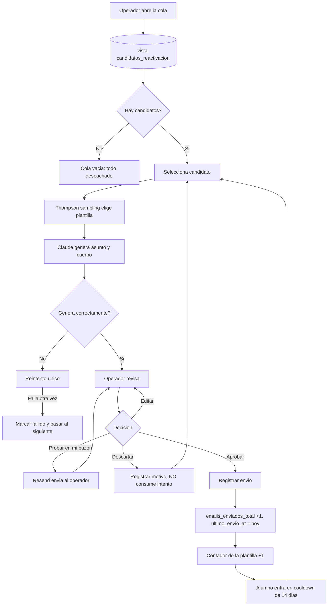
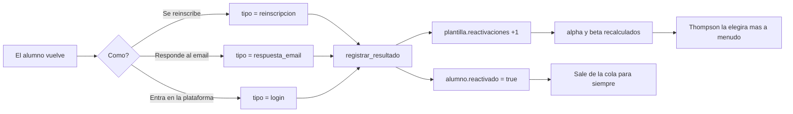

# Flujos de usuario

El PRD los describe narrativamente; aquí entramos en detalle con diagramas, estados y casos de
error. Cada flujo tiene un ID para poder referenciarlo desde el código o desde un PR.

**Actores:**
- **Operador** — la persona del equipo que revisa y aprueba.
- **Sistema** — la aplicación (incluyendo cron y webhooks).
- **Alumno** — no entra en la aplicación; solo recibe el email y puede darse de baja.

---

## [FLOW-01] — Carga inicial del dataset

**Actor:** Operador (una sola vez, en local)
**Trigger:** `pnpm seed`
**Resultado esperado:** base de datos con 300 alumnos, 8 plantillas y 317 envíos, y la vista
devolviendo candidatos.

### Pasos

1. Se aplican las migraciones en orden.
2. El script importa `plantillas` → `alumnos` → `envios` (orden obligado por las claves foráneas).
3. La importación hace *upsert* por `id`: reejecutarla no duplica nada.
4. Los campos `segmento` y `dias_inactivo` del CSV **se ignoran**: son derivados y los calcula la
   vista.
5. Verificación automática: la vista debe devolver ~100 candidatos y ninguno de los alumnos
   suprimidos (33 sin consentimiento, 19 dados de baja, 11 con rebote, 2 con queja, 45 en holdout).

### Casos de error

| Error | Respuesta |
|---|---|
| Falta la extensión `citext` | El script la habilita antes de crear las tablas |
| Un envío apunta a un alumno inexistente | Se detiene la importación y se reporta la fila. No se importan huérfanos |
| La verificación devuelve 0 candidatos | Error fatal: probablemente la fecha del sistema hace que nadie supere los 21 días. Se avisa explícitamente en vez de continuar con una cola vacía |

---

## [FLOW-02] — Revisar y aprobar un candidato

**Es el flujo principal del producto.** Todo lo demás existe para que este funcione.

**Actor:** Operador
**Trigger:** abre `/cola`
**Resultado esperado:** un email personalizado, revisado por un humano, registrado como enviado y
con el alumno en periodo de enfriamiento.

### Pasos

1. El operador abre la cola. El sistema lee la vista `candidatos_reactivacion` y muestra los
   candidatos ordenados: primero los que se fueron hace menos tiempo y más lejos habían llegado.
2. Selecciona un candidato. A la izquierda aparece la ficha completa: curso, sesión exacta donde se
   quedó, progreso, días inactivo, motivo declarado, historial de envíos e intentos restantes.
3. El sistema elige plantilla mediante Thompson sampling entre las variantes activas del segmento, y
   muestra cuál ha salido y con qué priors.
4. Claude genera asunto y cuerpo en streaming, a partir de la ficha y del tono/longitud/CTA de la
   plantilla.
5. El operador lee. Puede editar cualquier parte del texto —si lo hace, se marca
   `editado_por_humano`—.
6. **Aprobar y enviar:** se registra el envío (`estado_envio = 'enviado'`), se incrementa
   `emails_enviados_total`, se actualiza `ultimo_envio_at` y sube el contador de la plantilla.
7. El alumno desaparece de la cola: el enfriamiento de 14 días lo saca de la vista
   automáticamente.
8. La cola avanza al siguiente candidato.

### Diagrama

### Casos de error

| Situación | Respuesta |
|---|---|
| Claude falla o devuelve algo que no valida | Un reintento. Si vuelve a fallar, el borrador se marca `fallido` y se pasa al siguiente. Nunca se envía texto sin validar |
| El alumno deja de ser elegible mientras se revisa (se dio de baja, rebotó) | Al aprobar se revalida contra la vista. Si ya no está, no se envía y se avisa en pantalla |
| El operador aprueba dos veces por doble clic | La acción es idempotente por `id` de borrador. Un borrador solo puede pasar a `enviado` una vez |
| El texto generado menciona un descuento o una plaza reservada | El prompt lo prohíbe, pero la defensa real es la revisión humana. Si aparece, se descarta y se reporta como fallo de prompt |
| La cola está vacía | Estado explícito: no hay nadie elegible hoy, con el desglose de por qué (cuántos en enfriamiento, cuántos con el techo agotado) |

---

## [FLOW-03] — Envío real de prueba

**Actor:** Operador
**Trigger:** botón *Probar en mi buzón* desde cualquier borrador
**Resultado esperado:** el email tal cual, en la bandeja del operador.

### Pasos

1. El operador pulsa el botón sobre un borrador.
2. El sistema comprueba `ENVIO_REAL_HABILITADO`. Si está desactivado, no envía y lo dice.
3. Resend manda **exactamente el mismo email** a la dirección del operador, no a la del alumno.
4. Se guarda el `resend_id` para casar los webhooks posteriores.
5. Este envío **no cuenta** como intento del alumno ni afecta a los contadores de la plantilla.

### Casos de error

| Situación | Respuesta |
|---|---|
| `ENVIO_REAL_HABILITADO = false` | No se envía. Mensaje explicando que el modo real está desactivado |
| El destinatario no está en la lista permitida | Se rechaza. Solo pueden recibir envíos reales `EMAIL_OPERADOR` y `ALUMNO_REAL_EMAIL` —dos correos de la misma persona—. **Nunca se envía a una dirección del dataset**: son `@example.com` y rebotarían |
| Resend devuelve error | Se muestra el error, el borrador queda intacto y se puede reintentar |

---

## [FLOW-04] — Registrar resultado y actualizar el bandit

Es el flujo que hace que el sistema aprenda. Sin él, las plantillas nunca cambian de peso.

**Actor:** Operador (manual) o Sistema (webhook, Fase 2)
**Trigger:** un alumno vuelve — se reinscribe, responde al email o entra en la plataforma
**Resultado esperado:** resultado registrado y priors de la plantilla actualizados.

### Pasos

1. Se marca el envío con su resultado y tipo: `reinscripcion`, `respuesta_email` o `login`.
2. En una única transacción, la función `registrar_resultado()`:
   - escribe `reactivado`, `reactivado_at` y `tipo_reactivacion` en el alumno;
   - escribe `reactivado_at` y `tipo_reactivacion` en el envío;
   - incrementa `reactivaciones` de la plantilla;
   - recalcula `alpha = 1 + reactivaciones` y `beta = 1 + envios − reactivaciones`.
3. El alumno sale de la cola de forma permanente: la vista excluye a los ya reactivados.
4. La próxima vez que el bandit elija plantilla para ese segmento, esa variante tendrá más peso.

### Diagrama

### Casos de error

| Situación | Respuesta |
|---|---|
| Se registra el resultado dos veces | La función es idempotente: si el alumno ya está reactivado, no vuelve a sumar |
| El alumno vuelve sin haber recibido ningún email | Se registra en el alumno pero no toca ninguna plantilla. No hay a quién atribuirlo |
| El alumno está en el holdout y vuelve | Se registra igual. **Es exactamente el dato que da valor al holdout**: mide cuánta gente vuelve sola |

---

## [FLOW-05] — Baja del alumno (opt-out)

**Actor:** Alumno
**Trigger:** clic en el enlace de baja del email
**Resultado esperado:** no vuelve a recibir nada, de forma inmediata.

### Pasos

1. El alumno abre `/baja/[token]` — página pública, sin autenticación.
2. Confirma la baja con un clic.
3. Una función `security definer` escribe `opt_out_at` a partir del token.
4. La vista de candidatos deja de incluirlo al instante: la supresión no necesita ningún proceso
   adicional.
5. Se marca `unsubscribe` en el envío correspondiente.

### Casos de error

| Situación | Respuesta |
|---|---|
| Token inexistente o ya usado | Misma pantalla de confirmación en todos los casos. No se revela si el token era válido, para impedir enumeración |
| El alumno vuelve a pulsar el enlace | Idempotente: `opt_out_at` no se sobrescribe |
| Nunca se debe pedir el email para dar de baja | La baja se hace solo con el token. Pedir datos para irse es una práctica que no se implementa |

---

## [FLOW-06] — Consultar resultados

**Actor:** Operador
**Trigger:** abre `/resultados`
**Resultado esperado:** saber si esto funciona, y cuánto de ello es mérito del sistema.

### Pasos

1. **Uplift** arriba del todo: tasa de reactivación del grupo de tratamiento frente a la del
   holdout, con la diferencia en puntos porcentuales y el tamaño de ambos grupos siempre visible.
2. Desglose por segmento: cuál responde mejor.
3. Rendimiento por plantilla: envíos, reactivaciones, tasa y priors actuales. Se ve qué variantes
   está apagando el bandit.
4. Evolución temporal de envíos y reactivaciones.

### Casos de error

| Situación | Respuesta |
|---|---|
| Muestra insuficiente para comparar | Se muestra el dato con un aviso explícito de que la muestra es pequeña. **Nunca un porcentaje sin su denominador** |
| El uplift es negativo | Se muestra tal cual. Es la señal más valiosa que puede dar el sistema: significa que hay que parar y replantear el mensaje |

---

## [FLOW-07] — Preparación diaria de la cola (Fase 2)

**Actor:** Sistema
**Trigger:** Vercel Cron, una vez al día
**Resultado esperado:** los borradores del día listos antes de que llegue el operador.

### Pasos

1. El cron llama a `/api/cron/preparar-cola` autenticado con `CRON_SECRET`.
2. Lee la vista y toma los N primeros candidatos.
3. Para cada uno: elige plantilla y genera el borrador en estado `borrador`.
4. **No envía nada.** Solo deja trabajo preparado.

### Casos de error

| Situación | Respuesta |
|---|---|
| Petición sin `CRON_SECRET` válido | 401. El endpoint no es público |
| Falla la generación de algún borrador | Se marca ese como fallido y sigue con el resto. Un fallo no tumba la preparación entera |
| El cron se ejecuta dos veces el mismo día | No duplica: si el alumno ya tiene un borrador pendiente, se salta |
